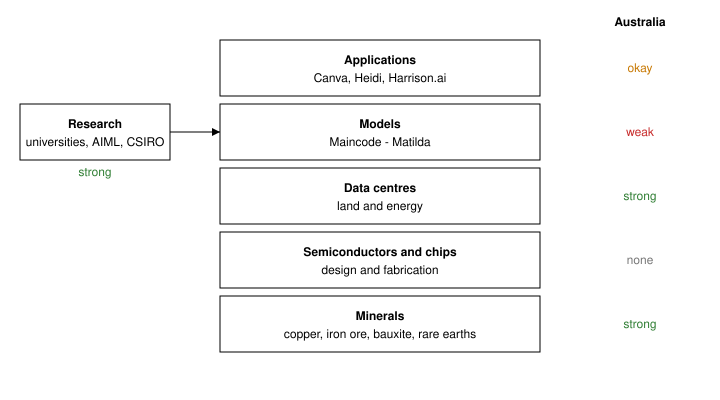

*unqualified thoughts on australia's place in ai*

<nav class="toc" markdown="1">
**contents**

* seed
{:toc}
</nav>

On the 31st of March this year, Anthropic signed a 'Memorandum of Understanding' [1] with the Australian government surrounding AI safety research and supporting the National AI Plan [2]. They also signed up for $3 million AUD in partnerships with Australian research institutions; this will be in the form of Claude credits [3]. This follows on from OpenAI signing a $7 billion AUD agreement with NEXTDC to build a 550MW datacenter in Western Sydney [4], signalling a large amount of activity surrounding AI within Australia. This prompts thinking about how Australia is positioned within the global AI landscape and how we can position ourselves to benefit from, and drive, the rollout of AI across the coming decade.

Reasons for wanting to be heavily involved in the rollout of AI range from economic and societal benefit to national security. Productivity growth in Australia has been nearly flat for ~ the past decade and the Productivity Commission puts the labour productivity uplift from AI at around 4.3% across the next 10 years [5], making it vital Australia tap into this and the infrastructure surrounding it. This adoption can occur without needing to build anything ourselves. However, even larger economic and societal gains will come to those who are building the frontier of AI, across the entire AI stack. Those building will develop the workforce capability, infrastructure and know-how to best capture available margin within the industry.

The National AI Plan [2], released in December last year, details the Australian Government's plan to grow the AI industry within Australia. The plan outlines three goals:

1. Capturing Opportunity - expand infrastructure to attract global partnerships
2. Spreading The Benefits - up-skilling Australians in the use of AI
3. Keeping Australians Safe - introducing legal, regulatory and ethical frameworks via the establishment of an AI Safety Institute

The plan reads as mostly consolidation, it pulls together ~$460 million of existing programs and adds $29.9 million for the Safety Institute while setting out 'expectations' rather than obligations, specifically around data centre development [6]. There is no official 'AI Act' as recommended by the Productivity Commission, which is fine, regulation will come. Importantly the plan has no position or plan on how Australia should get involved in the model layer of the AI stack, all of the economic value that gets derived from the application layer is dependent on the model layers. Frontier level capabilities are important at this layer in the stack.

## Current state of things

Australia is blessed with major advantages across the AI stack and already has strong potential in impacting the AI rollout across the next decade. This is seen across three main areas; minerals, data centres, and research.

<figure>
  
</figure>

At the bottom of the AI stack is minerals. The rollout of scaled up AI requires large amounts of minerals and rare earth elements. High performance, AI focussed chips require silicon, germanium and gallium. The electricity infrastructure required to power these needs large amounts of copper, aluminium and iron ore. Australia is the largest producer of iron ore and bauxite (aluminium ore) and holds the second largest copper resources in the world [7]. BHP's own modelling has copper used in data centres growing 6x by 2050, from ~0.5 million tonnes a year to ~3 million [8], with a single hyper-scale site using up to 50 000 tonnes and the electricity grid feeding it using even more. BHP plans to take Copper SA from about 316 000 tonnes of refined copper a year to more than 500 000 by the early 2030s, with a final investment decision on the Olympic Dam smelter and refinery expansion scheduled for the first half of FY27 [9] [10]. Australia currently produces very little gallium or germanium, however, both can be recovered as by-products from alumina and zinc refining, a process we already do [11]. The government's Critical Minerals Strategic Research is focussed on building this out alongside antimony and other rare earth elements. I was recently at an event hosted by Blackbird at which Gerrit Olivier, CSO at Fleet Space, spoke. Fleet Space uses satellites, gravitational and magnetic sensing and AI to search for potential mine sites across iron ore, copper and other minerals. Olivier predicted that, as memory is the current bottleneck in the AI rollout, copper will be the next. Australia is clearly positioned well to deliver on this. Clearly Australia is well positioned to deliver here.

Once minerals have been processed and foundries have produced the chips, they must be colocated into data centres. The largest data centres, on a global scale, now span hundreds of hectares and require close to 1GW. This is equivalent to the output of a large power station. Building out this infrastructure requires both land and energy. Australia has both of these. We have space, a stable grid and one of the best renewable energy resource bases in the world. A good example of this is Firmus's green data centre being built in Tasmania, drawing on Tasmanian hydro. They raised $830 million AUD across 2025 to build this [12] [13]. We are seeing the frontier labs identify Australia as good ground to invest in data centres as they scale up their inferencing and serving capabilities. As previously mentioned, this is evidenced by OpenAI committing $7 billion AUD to a 550MW data centre [4]. The ABS notes $2.6 billion of data centre equipment spending in the September 2025 quarter alone, up 143% the year before [14].

Alongside scaling up compute, models and datasets, the rise of AI across the last 5-6 yrs has stemmed from new advancements in algorithms, training and inferencing, directly resulting from academic and industry research output. Australia produces ~1.9% of global AI research publications, down from 2.6% in 2015 (evidently the rest of the world moved quicker than we did) [15]. The Australian Institute for Machine Learning (AIML) of Adelaide University has previously been ranked second in the world for computer vision research across 2016 to 2021 [16]. This is in addition to numerous other AI focussed research institutes such as ANU, UNSW, UoS and UoM. More generally, Australia has 10 universities in the Times Higher Education top 200 [17]. Australia has the brain power and research know-how to push the frontier of artificial intelligence through research, and has been doing so for a while.

Together, these position Australia incredibly well across a few key areas in the AI stack, specifically areas that may become bottlenecks as the AI rollout occurs across the next decade. However, so far, we have not been able to turn this into a clear advantage in frontier AI capabilities or into the GDP increase that AI is supposed to bring.

## What is being built in Australia off the back of our advantage?

The Australian Government has, alongside the National AI Plan, added up to $70 million for AI accelerator grants through the CRC program as per the May budget [18]. Regulation wise, there is no specific AI act and no dedicated regulator.

Within Industry, at the application or model level, Australia has a few players, their contributions are impressive when considered alongside their lack of capital. Leonardo.Ai, acquired by Canva in 2024, has started rolling out Phoenix, a foundational generative model trained internally [19]. This marks Australia's first major home-grown generative model. Maincode has recently trained Matilda, a large language model trained and hosted entirely on Australian infrastructure. Maincode used their own GPUs, with no reliance on hyper-scalers [20]. This makes it a true sovereign capability. They have estimated that to train a 30 billion parameter model it would cost tens of millions of dollars [21]. Note the frontier models are at the trillions of parameters, highlighting the gap in capability. At the application layer, Heidi Health and Harrison.ai are two standouts in Australia. Heidi's AI scribe is now used across 116 countries [22] and by one in two GPs in the UK while supporting 1.5 million NHS appointments a month [23]. They raised US $65 million last October at a US $465 million valuation [24]. Harrison.ai's radiology and pathology models are deployed in more than 1 000 healthcare facilities [25]. Pluralis Research is focussed on decentralising training. They want to see a foundation model trained across machines connected only over the internet. Early last year they raised US $7.6 million [26]. Their product aims to reduce the need for these large scale data centres and democratise access to training infrastructure.

Our top institutions are also still publishing novel and frontier research at the top AI conferences.

## What is missing?

Although Australia is very well placed to capitalise at the bottom of the AI stack (minerals, land, energy) and has world class contributions to AI research, we see a middle layer, the model, and the application layer above, where we are either weak or we lack. We have huge mining capabilities across a copper, bauxite and iron ore, however, we export this and never build any of the derivative products nor see the economic value they provide to others doing the building. We have no frontier model capabilities, large scale ML Engineering nor the compute to support either of these. Clearly we are missing something.
[note we also have minimal to no semiconductor manufacturing or fabrication capabilities, this is such a complex part of the AI stack we won't consider Australia investing in this part any time soon.]

As the areas in which we lack are immensely capital intensive, it may be a reflection of reluctance from Australian capital providers to take on risk. As of early 2025, only 4.9% of superannuation assets were in private equity, venture capital or private credit combined. This is well below the US and North American pension funds [27]. This is exemplified in Fleet Space's biggest round being led by a pension fund from Ontario, not by Australian capital.

We have very high quality research but few of these papers get turned into commercial opportunities, with 23 research papers to every AI-related patent [15]. Although patents aren't a perfect measure for AI commercialisation as much of the frontier lives in trade secrets, this stat is still indicative of a lack of commercialisation. While we still maintain excellent research, our share of global AI publications has fallen from 2.6% in 2015 to 1.9% in 2024 and our share of patents at 0.18% [15]. We have the brain power and people but we do not have the compute nor the capital required to make our most brilliant researchers as impactful as they could otherwise be. Australia's national research supercomputers, Gadi at NCI and Setonix at Pawsey, could only supply a third of the amount of compute time that was requested [28]. Again, not all of this is requested for AI specific research, but it is indicative.

It seems there is also an apathy toward ensuring Australia remains at the forefront of the AI rollout and to gain frontier capabilities. Early last year the CEO of Telstra said "I don’t think Australia needs to be investing in things like building Large Language Models — I do think that’s a global game" [29]. The argument here is that the models are available to use and cheap in comparison to the development cost. Hence, it is argued it makes much more sense to just buy the capabilities of frontier AI models from foundational labs. I think this is a misunderstanding of what AI is going to be as a technology and how it will change society. Remaining at the mercy of foreign entities for access to this technology is extremely dangerous for Australia's national security and productivity. AIML's Chief Scientist, Anton van den Hengel, has been saying this for a while, arguing to the Senate that a foundational AI model is not a product but leans more toward infrastructure. Australia will have no competitive advantage over other countries without its own sovereign model capability [30]. If nobody in Australia is training frontier level AI models, our workforce lacks a skill and know-how that will drive the next stage of human progress. Kangaroo LLM is another good example of this apathy. Backed by NEXTDC, HPE and others in 2024, Kangaroo LLM was to be a national open-source model. The project was run on unpaid volunteers and promised a first model in late 2024 [31]; as of now, there is still nothing released. While open-source is a credible movement, looking to create impactful and impressive sovereign AI capabilities to rival other countries, or foundation labs, off the back of unpaid volunteers is not going to work. We must view OpenAI, Anthropic and the Chinese labs as our competition and the benchmark we aspire to. Frontier capability needs capital and the ability to move fast. That is what private companies are good at.

There is growing political concern around the data centre build out itself. If multinationals (aka OpenAI and Anthropic) are going to use Australian land, energy and water, then Australians deserve a fair return. We risk becoming a side item in the rollout of these data centres if we don't carefully consider their development and how Australians can be ensured they, and the land, benefit. Both hyper-scaler agreements signed this year are non-binding and neither includes procurement preferences or compute access for Australian researchers or companies. We have the land, the minerals, the energy and the regulatory environment these companies need and, so far, the agreements seem more one sided.

## What do we need to change?

In order to ensure Australia not only remains relevant but can drive and contribute to the AI rollout without becoming a passenger, there are a few things we need to address.

We need to set up companies like Maincode to succeed as best they can. Backing and enabling private companies with the potential to build out sovereign AI capabilities is going to play a large part in Australia getting frontier level capabilities. This can be done through three mechanisms. Firstly, in setting up a national compute reserve through the expanding of existing national supercomputer infrastructure and reserve capacity inside hyper-scaler data centres. This is similar to the UK's Isambard-AI initiative. Second, the government needs to position themselves as a primary customer of these companies and the models they produce. Integrating sovereign models here is sensible from a defence, health and policy privacy perspective, separate from providing Maincode and others the capital to succeed. Third, there should be a co-investment strategy to match private rounds for model-layer companies while also supporting the superannuation funds in investing into these types of ventures.

Attach conditions to data centre build out and hosting. We need to understand the value we hold at this position in the AI stack. The hyper-scalers, OpenAI and Anthropic need our land, minerals, energy and stable regulatory environment to successfully scale out their data centres. These agreements currently seem skewed toward their benefit and we need to ensure Australians get equal benefit. This can be done through four main avenues:

1. Compute: Anthropic has put up $3 million in Claude credits to help with AI safety research [1], however, it would serve Australia to get direct access to compute for research purposes instead. As part of these agreements with the hyper-scalers to develop data centres, we need to be ensuring there is compute allocation provided solely for Australian-based research.
2. Local supply chain benefit: These agreements should also put an emphasis, or guarantee, the developers of these data centres invest into local supply chains.
3. Tax: These data centres also need to be taxed. We cannot repeat the experience of other large Australian industries, such as gas, where resources are being taken from our land and minimal tax being paid. Data centres draw on the Australian infrastructure and land, they should be taxed appropriately.
5. Location: Data centres are large, permanent and industrial buildings that contribute noise and visual pollution to neighbourhoods. Communities should be able to drive the decisions around where these are situated. The placement of these data centres should pass a common sense test. They are industrial facilities and as such belong in industrial zones, not directly within urban or residential spaces. Like all AI, the development of these data centres should be human centric.

Focus on funding the translation of AI research through to patent generation and then on to company formation. We have world class research that struggles to make commercial impact through the formation of companies or designation of patents. We should focus the CRC Accelerator and other equivalent funds at this task. In a similar vein, our Australian AI companies need to start publishing research. The best AI researchers publish at top AI conferences and are much less likely to join a private company, with the required capital to turn research into commercial opportunity, if they are blocked from doing so.

In summary, Australia has some incredible assets working in our favour, however, we have work to do and an attitude to shift if we are to avoid becoming passengers and instead want to maximise benefit to our society across the coming decades.

## References
{:.no_toc}

<ol class="refs">
  <li>Minister for Industry and Innovation, "New agreement on AI collaboration with Anthropic", 1 April 2026. <a href="https://www.minister.industry.gov.au/ministers/charlton/media-releases/new-agreement-ai-collaboration-anthropic">https://www.minister.industry.gov.au/ministers/charlton/media-releases/new-agreement-ai-collaboration-anthropic</a></li>
  <li>Department of Industry, Science and Resources, <em>National AI Plan</em>, 2 December 2025. <a href="https://www.industry.gov.au/publications/national-ai-plan">https://www.industry.gov.au/publications/national-ai-plan</a></li>
  <li>Capital Brief, "Anthropic signs MoU with federal government to collaborate on AI", 1 April 2026. <a href="https://www.capitalbrief.com/briefing/anthropic-signs-mou-with-federal-government-to-collaborate-on-ai-937773af-e58c-49d0-9f1d-885f792e806f/">https://www.capitalbrief.com/briefing/anthropic-signs-mou-with-federal-government-to-collaborate-on-ai-937773af-e58c-49d0-9f1d-885f792e806f/</a></li>
  <li>Information Age, "OpenAI, NextDC ink $7b Australian data centre deal", December 2025. <a href="https://ia.acs.org.au/article/2025/openai--nextdc-ink--7b-australian-data-centre-deal.html">https://ia.acs.org.au/article/2025/openai--nextdc-ink--7b-australian-data-centre-deal.html</a></li>
  <li>Productivity Commission, <em>Harnessing data and digital technology</em>, final report, released 19 December 2025. <a href="https://www.pc.gov.au/inquiries/completed/data-digital/report">https://www.pc.gov.au/inquiries/completed/data-digital/report</a></li>
  <li>Department of Industry, Science and Resources, <em>Expectations of data centres and AI infrastructure developers</em>, 23 March 2026. <a href="https://www.industry.gov.au/NationalDataCentreExpectations">https://www.industry.gov.au/NationalDataCentreExpectations</a></li>
  <li>Geoscience Australia, <em>Australia's Identified Mineral Resources 2024</em>, world rankings. <a href="https://www.ga.gov.au/aimr2024/world-rankings">https://www.ga.gov.au/aimr2024/world-rankings</a></li>
  <li>BHP, "Why AI tools and data centres are driving copper demand", January 2025. <a href="https://www.bhp.com/news/bhp-insights/2025/01/why-ai-tools-and-data-centres-are-driving-copper-demand">https://www.bhp.com/news/bhp-insights/2025/01/why-ai-tools-and-data-centres-are-driving-copper-demand</a></li>
  <li>Australian Mining, "BHP details plans for SA copper expansion". <a href="https://www.australianmining.com.au/bhp-advances-smelter-and-refinery-expansion-in-sa/">https://www.australianmining.com.au/bhp-advances-smelter-and-refinery-expansion-in-sa/</a></li>
  <li>TheFly (via TipRanks), "Fluor joint venture awarded contract for BHP Group Olympic Dam Smelter project", December 2024. <a href="https://www.tipranks.com/news/the-fly/fluor-joint-venture-awarded-contract-for-bhp-group-olympic-dam-smelter-project">https://www.tipranks.com/news/the-fly/fluor-joint-venture-awarded-contract-for-bhp-group-olympic-dam-smelter-project</a></li>
  <li>Geoscience Australia, <em>Australia's Identified Mineral Resources 2025</em>, introduction. <a href="https://www.ga.gov.au/aimr2025/introduction">https://www.ga.gov.au/aimr2025/introduction</a></li>
  <li>W.Media, "Firmus raises AUD 330 million for Tasmania AI factory", September 2025. <a href="https://w.media/firmus-raises-aud-330-million-for-tasmania-ai-factory/">https://w.media/firmus-raises-aud-330-million-for-tasmania-ai-factory/</a></li>
  <li>Seeking Alpha, "Nvidia-backed Firmus raises $327 million for AI data center push in Australia", November 2025. <a href="https://seekingalpha.com/news/4522113-nvidia-backed-firmus-raises-327-million-for-ai-data-center-push-in-australia">https://seekingalpha.com/news/4522113-nvidia-backed-firmus-raises-327-million-for-ai-data-center-push-in-australia</a></li>
  <li>Australian Bureau of Statistics, "Spotlight: Data centres in economic statistics". <a href="https://www.abs.gov.au/articles/spotlight-data-centres-economic-statistics">https://www.abs.gov.au/articles/spotlight-data-centres-economic-statistics</a></li>
  <li>National AI Centre and CSIRO, <em>Australia's artificial intelligence ecosystem: growth and opportunities</em>, June 2025. <a href="https://www.ai.gov.au/news-and-insights/reports/australias-artificial-intelligence-ecosystem-growth-and-opportunities">https://www.ai.gov.au/news-and-insights/reports/australias-artificial-intelligence-ecosystem-growth-and-opportunities</a></li>
  <li>Australian Institute for Machine Learning, "AIML confirmed as 2nd in the world for computer vision research", March 2021. <a href="https://www.adelaide.edu.au/aiml/news/list/2021/03/30/aiml-confirmed-as-2nd-in-the-world-for-computer-vision-research">https://www.adelaide.edu.au/aiml/news/list/2021/03/30/aiml-confirmed-as-2nd-in-the-world-for-computer-vision-research</a></li>
  <li>Study Australia (Australian Government), "Australia shines again in Times World University Rankings 2026", October 2025. <a href="https://www.studyaustralia.gov.au/en/tools-and-resources/news/the-world-university-rankings-2026">https://www.studyaustralia.gov.au/en/tools-and-resources/news/the-world-university-rankings-2026</a></li>
  <li>Commonwealth of Australia, <em>Budget 2026-27</em>, 12 May 2026. <a href="https://budget.gov.au/">https://budget.gov.au</a></li>
  <li>Capital Brief, "Leonardo.Ai is rolling out Australia's first major foundation model", January 2026. <a href="https://www.capitalbrief.com/article/leonardoai-is-rolling-out-australias-first-major-foundation-model-a576494a-be4d-4bc0-ab13-e829ec249f2d/">https://www.capitalbrief.com/article/leonardoai-is-rolling-out-australias-first-major-foundation-model-a576494a-be4d-4bc0-ab13-e829ec249f2d/</a></li>
  <li>Startup Daily, "Australia's large language model Matilda joins the global AI race", October 2025. <a href="https://www.startupdaily.net/topic/artificial-intelligence-machine-learning/australias-large-language-model-matilda-joins-the-global-ai-race-as-maincodes-dave-lemphers-outlines-his-national-ambitions/">https://www.startupdaily.net/topic/artificial-intelligence-machine-learning/australias-large-language-model-matilda-joins-the-global-ai-race-as-maincodes-dave-lemphers-outlines-his-national-ambitions/</a></li>
  <li>D. Lemphers, "The sovereign AI race is on and Australia can't afford to sit it out", Forbes Australia, September 2025. <a href="https://www.forbes.com.au/news/innovation/the-sovereign-ai-race-is-on-and-australia-cant-afford-to-sit-it-out/">https://www.forbes.com.au/news/innovation/the-sovereign-ai-race-is-on-and-australia-cant-afford-to-sit-it-out/</a></li>
  <li>Fierce Healthcare, "Beth Israel Lahey Health taps Heidi for system-wide AI scribe rollout", 1 May 2026. <a href="https://www.fiercehealthcare.com/ai-and-machine-learning/beth-israel-lahey-health-rolls-out-heidi-ai-scribe-system-wide">https://www.fiercehealthcare.com/ai-and-machine-learning/beth-israel-lahey-health-rolls-out-heidi-ai-scribe-system-wide</a></li>
  <li>Open Access Government, "Turning policy into practice: Heidi Health and the NHS 10-year plan", 9 October 2025. <a href="https://www.openaccessgovernment.org/turning-policy-into-practice-heidi-health-and-the-nhs-10-year-plan/199488/">https://www.openaccessgovernment.org/turning-policy-into-practice-heidi-health-and-the-nhs-10-year-plan/199488/</a></li>
  <li>Heidi Health, "Heidi raises US$65M Series B", October 2025. <a href="https://www.heidihealth.com/en-us/blog/heidi-series-b">https://www.heidihealth.com/en-us/blog/heidi-series-b</a></li>
  <li>Harrison.ai, "Harrison.ai secures US$112 million in Series C funding round", 11 February 2025. <a href="https://harrison.ai/news/harrison-ai-secures-us112-million-in-series-c-funding-round/">https://harrison.ai/news/harrison-ai-secures-us112-million-in-series-c-funding-round/</a></li>
  <li>Fortune, "Pluralis Research raises $7.6 million", 19 March 2025. <a href="https://fortune.com/crypto/2025/03/19/pluralis-research-7-6-million-openai-coinfund-union-square-ventures/">https://fortune.com/crypto/2025/03/19/pluralis-research-7-6-million-openai-coinfund-union-square-ventures/</a></li>
  <li>Chronograph, "A PE Investor's Guide to Superannuation Fund Regulation", 15 January 2025. <a href="https://www.chronograph.pe/a-pe-investors-guide-to-superannuation-fund-regulation/">https://www.chronograph.pe/a-pe-investors-guide-to-superannuation-fund-regulation/</a></li>
  <li>NCI, "Record demand highlights Australia's growing need for supercomputing power", November 2025. <a href="https://nci.org.au/news-events/news/record-demand-highlights-australias-growing-need-supercomputing-power">https://nci.org.au/news-events/news/record-demand-highlights-australias-growing-need-supercomputing-power</a></li>
  <li>Information Age, "Telstra CEO: Australia doesn't need its own LLMs", February 2025. <a href="https://ia.acs.org.au/article/2025/telstra-ceo--australia-doesn-t-need-its-own-llms.html">https://ia.acs.org.au/article/2025/telstra-ceo--australia-doesn-t-need-its-own-llms.html</a></li>
  <li>A. van den Hengel, submission to the Senate Select Committee on Adopting Artificial Intelligence, 2024.</li>
  <li>Information Age, "Australian AI project calls for more unpaid volunteers", 2024. <a href="https://ia.acs.org.au/article/2024/australian-ai-project-calls-for-more-unpaid-volunteers.html">https://ia.acs.org.au/article/2024/australian-ai-project-calls-for-more-unpaid-volunteers.html</a></li>
</ol>
