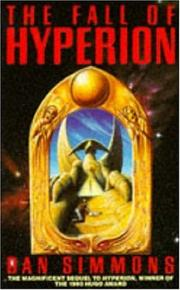
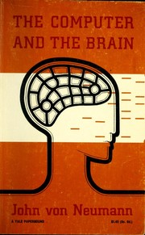

*2026 reading. updated progressively. potential spoilers*

## reading

  
  

  **[The Fabric of Reality](https://www.goodreads.com/book/show/177068.The_Fabric_of_Reality)** by David Deutsch  
  currently reading.  
  

## read

  
  

  **[Hyperion](https://www.goodreads.com/book/show/77566.Hyperion)** by Dan Simmons (March)  
  Dan Simmons builds this world so beautifully through drip feeding the reader very specific details. This forces the reader to constantly update their internal model of the world.  
  The story and the writing feels very original.  
  A very good book to read given the current state and progress of AI.  
  

  
  

  **[The Fall of Hyperion](https://www.goodreads.com/book/show/77565.The_Fall_of_Hyperion)** by Dan Simmons (April)  
  [Slight Spoilers Ahead]  
  As above, "A very good book to read given the current state and progress of AI."  
  The Hegemony vs the Ousters may be read as two different ways a civilisation could handle the progression and adoption of technology, specifically, the adoption of artificial intelligence. The TechnoCore is the Hegemony's (humanity's main civilisation) network of AI advisors, once developed by humanity, they withdrew into their own organised civilisation. The Hegemony has outsourced the development of new technologies (health, defence, transportation etc) and the maintenance of existing infrastructure. As the TechnoCore's motives and ambitions diverged from the Hegemony's, to the point they were actively against the Hegemony, the Hegemony was left without the means to understand nor control the technology they depended on in day-to-day life. In contrast the Ousters rejected dependence on the TechnoCore and continued to develop their own technology through deepening their understanding of biological systems.  
  Which path will we take? Will we use AI as tools to further our own science and technology or hand it over? Are the dangers of reliance on AI as presented in the Hyperion world real?  
  

  
  

  **[The Maniac](https://www.goodreads.com/book/show/75665931-the-maniac)** by Benjamín Labatut (April)  
  Really really well blended fact and fiction. The first half of the 20th century was such an exciting time in science, maths and physics; this book contained fascinating storytelling of the characters behind it. Main takeaway is just how ambitious John von Neumann and his peers were in what they thought about and what they wanted to accomplish in their lifetimes, although I'm no child prodigy, there's no reason to not show the same ambition. Think big.  
  

  
  

  **[The Computer and the Brain](https://www.goodreads.com/book/show/358880.The_Computer_and_the_Brain)** by John von Neumann (May)  
  Contains a set of lectures von Neumann was writing when he died in 1957. I read this after The Maniac to get a taste of von Neumann's work. He compares computers (the von Neumann architecture) to the human nervous system. He comes to the conclusion that the brain must be doing low precision but highly parallel and deep computations. Fast forwarding to today he probably wouldn't be surprised to see we have achieved the levels of AI we have through highly scaled up parallel computations run on a GPU. Pretty incredible that von Neumann was able to make these observations given the state of neuroscience in the 1950s. He loosely predicted deep neural networks!
  

  

